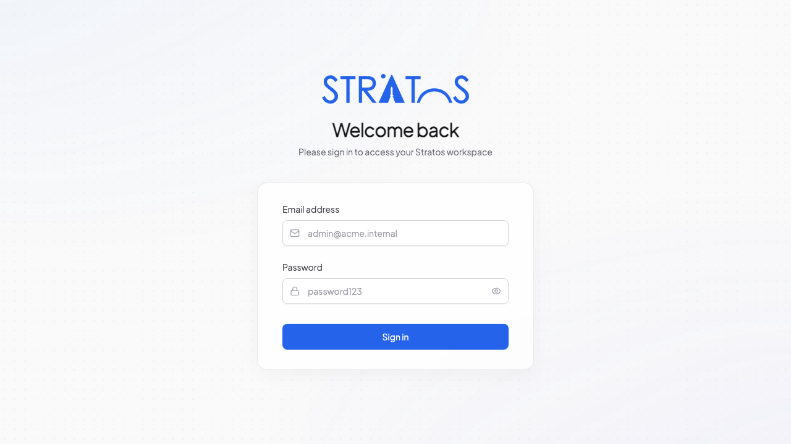

# 1. Getting Started & Account Setup

Welcome to Stratos! This guide will walk you through setting up your account so you can start collaborating with your team.

## Logging In

To access Stratos, navigate to your company's designated URL (e.g., `https://stratos.yourcompany.com`). 

1. Enter your **Email Address** and **Password**.
2. If your company uses Single Sign-On (SSO) like Google or Okta, click the respective button below the main login form.
3. If you have forgotten your password, click the **Forgot Password?** link. You will receive an email with a secure link to reset it.

## Configuring Your Profile

Before diving into work, it’s best to set up your profile so your team recognizes you.

1. Click on your avatar in the bottom-left corner of the sidebar.
2. Select **Profile Settings**.
3. **Avatar**: Upload a clear photo of yourself.
4. **Name & Role**: Ensure your name and job title are correct.

### Notification Preferences
In the same settings menu, navigate to the **Notifications** tab. Here you can configure how Stratos alerts you:
* **Email Notifications**: Toggle daily summaries or instant alerts for mentions.
* **In-App Notifications**: Choose which board events (like stage changes or new comments) trigger an alert in your Inbox.
