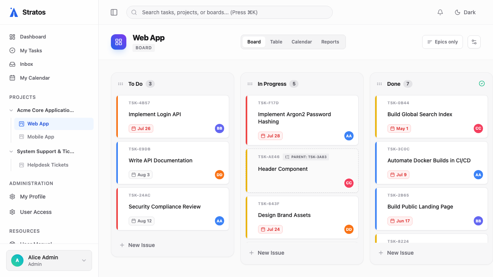

# 2. Projects & Boards

Stratos organizes work hierarchically: **Projects** contain **Boards**, and Boards contain your tasks.

## Creating Your First Project

A project typically represents a large team or a broad initiative (e.g., "Engineering" or "Q3 Marketing Campaign").

1. In the left sidebar, click the **+** icon next to the **Projects** header.
2. Enter a Project Name and an optional description.
3. Once created, you will see it listed in your sidebar.

## Setting Up a Board

A board represents a specific workflow or product area.

1. Hover over your new Project in the sidebar and click the **+** icon to add a Board.
2. Give the board a name (e.g., "Frontend Tasks").
3. By default, the board is created with standard Kanban stages: *Todo*, *In Progress*, and *Done*.

### Customizing Column Stages
Every team works differently. To change the workflow:
1. Click the **Board Settings** (gear icon) in the top right of the board view.
2. Navigate to **Stages**.
3. Here you can **Rename**, **Add**, or **Reorder** stages to match your exact process (e.g., adding a "QA Review" column).

## Managing Access & Inviting Team Members
To collaborate, you need your team!
1. In the Board Settings, go to the **Members** tab.
2. Type a colleague's name or email to invite them.
3. Assign them a role:
   * **Viewer**: Can only read tasks and comment.
   * **Member**: Can create and edit tasks.
   * **Admin**: Can modify board settings and stages.
