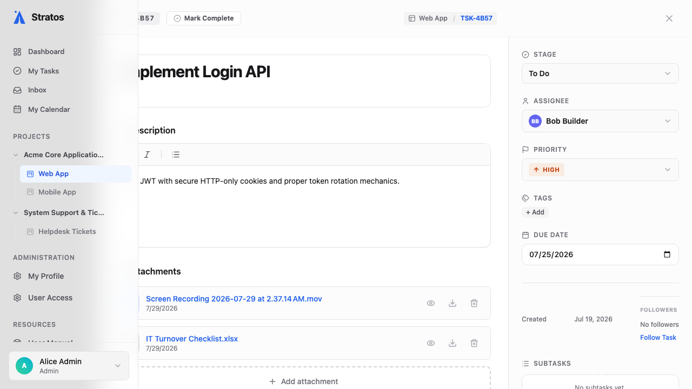

# 3. Managing Tasks

Tasks are the fundamental units of work. This section covers creating and tracking your work from start to finish.

## Creating a Task

1. On any board, click the **New Task** button at the top right, OR press `C` on your keyboard.
2. Enter a descriptive title and press `Enter`. The task will appear in your first column.

## The Task Drawer

Clicking on a task card opens the **Task Drawer**, a detailed view where all collaboration happens.

### 1. Rich Text & Attachments
The description field uses a powerful WYSIWYG editor. 
* **Formatting**: You can highlight text to use the formatting toolbar, or use standard Markdown shortcuts (e.g., typing `# ` creates a heading, `* ` creates a bulleted list).
* **Mentions**: Type `@` to tag teammates; they will receive an Inbox notification.
* **Attachments**: Drag and drop images, PDFs, or documents directly into the description or the comment area to attach them to the task.

### 2. Properties (Right Panel)
* **Assignees**: Delegate the task to one or more team members.
* **Status**: Move the task through its lifecycle (equivalent to dragging it across the board).
* **Priority & Due Date**: Set urgency and deadlines to keep work on track.
* **Story Points / Estimates**: Input a numerical value (e.g., 3, 5, 8) to represent the effort required. This data is critical for generating Burndown charts in the Reports view.

### 3. Checklists & Dependencies
* **Checklists**: Break the task into smaller sub-items.
* **Dependencies**: If Task A must be finished before Task B, link them! In the Task Drawer, click **Link Task**, select the blocking task, and set the relationship to "Blocks" or "Is Blocked By".
  * *What happens when a blocker is completed?* When the blocking task is moved to the "Done" stage, the assignees of the blocked task will automatically receive an Inbox notification alerting them that they are now unblocked and can begin work.

## Deleting or Archiving Tasks
If a task was created by mistake or is no longer relevant:
1. Open the Task Drawer.
2. Click the **...** (Options) menu in the top right.
3. Select **Archive** to hide it from the active board but keep the record, or **Delete** to permanently remove it (Admin only).
