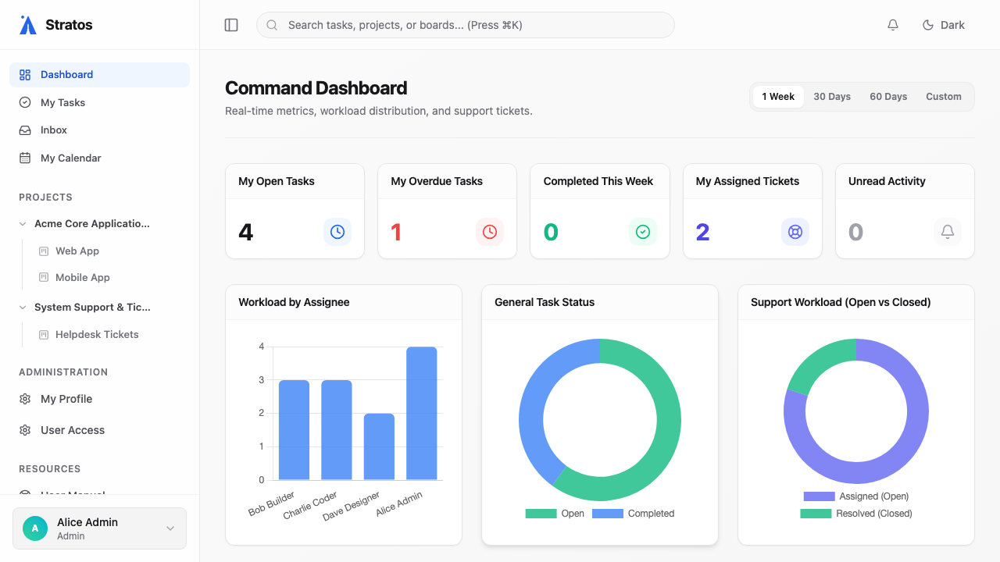

# 4. Staying Updated & Navigating

As your workspace grows, keeping track of everything becomes crucial. Stratos offers several centralized hubs to manage your attention.

## The Dashboard Overview

Whenever you log in or click the Stratos logo, you land on your personalized **Dashboard**.



* **Metrics & Analytics**: See exactly how many tasks you have open, what is overdue, and what you've completed this week.
* **My Recent Tasks**: Jump right back into the tasks you were working on yesterday without hunting through project boards.

## Managing the Inbox

The **Inbox** (accessible from the left sidebar) is your personal notification center.

1. When someone `@mentions` you, assigns a task to you, or replies to a thread you follow, a notification appears here.
2. Click on a notification to view the context directly inside the Inbox side-panel.
3. Once you have read and processed the update, click **Mark as Read** (or the checkmark icon) to clear it from your active list.
4. **Where did it go?** Your Inbox has two tabs: *Active* and *Cleared*. If you accidentally mark something as read, click the *Cleared* tab, find the notification, and click **Mark as Unread** to move it back.

### Task Followers & Email Notifications

You can opt-in to follow a task without being the assignee by clicking the **Follow Task** button in the task's properties sidebar.

- **In-App Notifications**: Followers will automatically receive Inbox notifications for **new comments only**. Status updates, due date changes, or priority changes do *not* currently trigger notifications for followers (only assignees are notified of major state changes).
- **Email Notifications**: To prevent spam, Stratos enforces a strict anti-spam rule: it *only* dispatches an email notification if you are explicitly `@mentioned` in the comment (e.g., `@steve I finished the design.`). This is a hardcoded system rule and cannot currently be overridden in user preferences to receive emails for all comments.

#### Configuring Email Providers (Admin)

Emails are routed instantly via SMTP, Amazon SES, or Resend. Administrators must configure these via server environment variables (`.env` file) before startup. The system will cascade and select the first available provider:

1. **SMTP (Nodemailer)**: Requires `SMTP_HOST` and `SMTP_USER` (plus `SMTP_PORT` and `SMTP_PASS`).
2. **Amazon SES (v3)**: Used if SMTP is not set. Requires `AWS_REGION` and `AWS_ACCESS_KEY_ID` (plus `AWS_SECRET_ACCESS_KEY`).
3. **Resend API**: Fallback if neither SMTP nor SES are configured. Requires `RESEND_API_KEY`.

## The Helpdesk

The **Helpdesk** module is designed for teams that process inbound requests (like IT support or client requests). 

### Configuring Helpdesk Webhooks
Instead of manually creating tasks, external tools can create tasks on your board automatically.
1. Navigate to **Board Settings -> Integrations**.
2. Under "Helpdesk", click **Generate Webhook URL**.
3. Send a standard HTTP POST request to this URL with a JSON payload containing `title`, `description`, and `requester_email`.
   ```json
   {
     "title": "Server outage",
     "description": "The production server is down.",
     "requester_email": "client@example.com"
   }
   ```
4. These tasks arrive in a special "Helpdesk Triage" queue. They are triaged by a designated manager before being converted into standard tasks and assigned to the team.

## Global Search & Command Palette

Don't want to click through menus? Use the Command Palette.
* Press `Cmd + K` (Mac) or `Ctrl + K` (Windows) anywhere in the app.
* Type the name of a project, board, or task.
* Instantly navigate to your destination.
